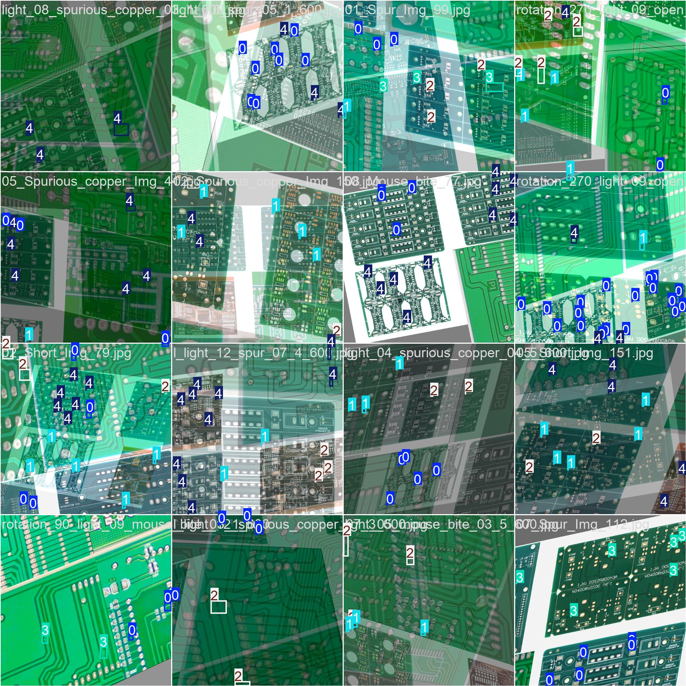
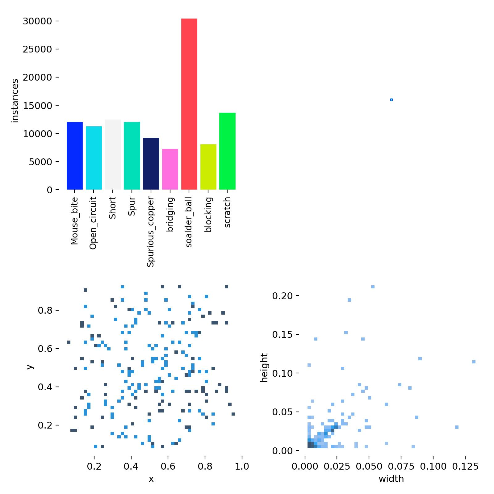
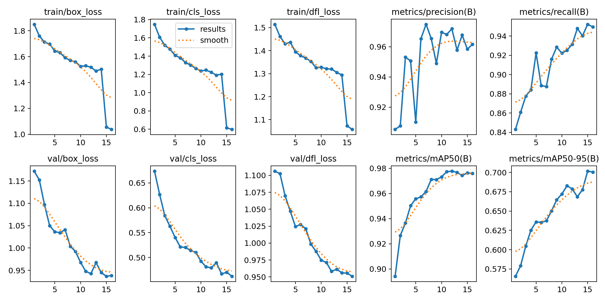
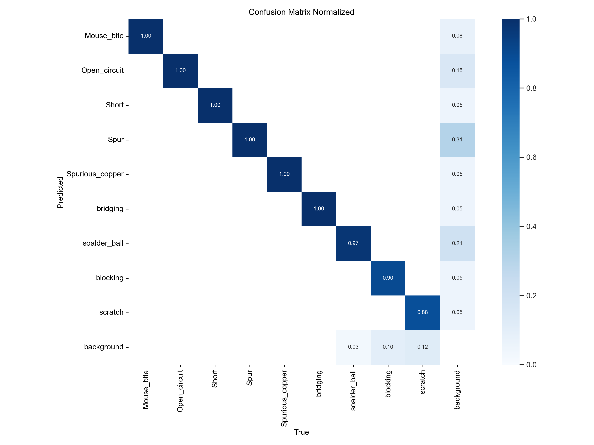

<!-- coding=utf-8
Copyright 2024 Jingze Shi and Bingheng Wu.    All rights reserved.

Licensed under the Apache License, Version 2.0 (the "License");
you may not use this file except in compliance with the License.
You may obtain a copy of the License at

    http://www.apache.org/licenses/LICENSE-2.0

Unless required by applicable law or agreed to in writing, software
distributed under the License is distributed on an "AS IS" BASIS,
WITHOUT WARRANTIES OR CONDITIONS OF ANY KIND, either express or implied.
See the License for the specific language governing permissions and limitations under the License. -->

# 终审Top10改进

**团队:** Thank you Cheems

## 作品介绍

此方案主要是针对 **实际工业质检** 场景, 对数据增强与模型训练两个部分进行优化, 以提高模型的泛化能力与鲁棒性。

### 数据抽象增强
常见的数据增强方法包括:

| 方法 | 类型 | 默认值 | 范围 | 说明 |
| --- | --- | --- | --- | --- |
| hsv_h | float | 0.2 | 0.0 - 1.0 | 通过色轮的一部分来调整图像的色调, 从而引入色彩的可变性. 帮助模型在不同的光照条件下通用化. |
| hsv_s | float | 0.6 | 0.0 - 1.0 | 改变图像饱和度的一部分, 影响色彩的强度. 可用于模拟不同的环境条件. |
| hsv_v | float | 0.4 | 0.0 - 1.0 | 将图像的亮度修改一部分, 帮助模型在不同的光照条件下表现良好. |
| degrees | float | 15.0 | -180 - +180 | 在指定的度数范围内随机旋转图像, 提高模型识别不同方向物体的能力. |
| translate | float | 0.1 | 0.0 - 1.0 | 以图像大小的一小部分水平和垂直平移图像, 帮助学习检测部分可见的物体. |
| scale | float | 0.5 | >= 0.0 | 通过增益因子缩放图像, 模拟物体与摄像机的不同距离. |
| shear | float | 15.0 | -180 - +180 | 按指定角度剪切图像, 模拟从不同角度观察物体的效果. |
| perspective | float | 0.0001 | 0.0 - 0.001 | 对图像进行随机透视变换, 增强模型理解三维空间中物体的能力. |
| flipud | float | 0.5 | 0.0 - 1.0 | 以指定的概率将图像翻转过来, 在不影响物体特征的情况下增加数据的可变性. |
| fliplr | float | 0.5 | 0.0 - 1.0 | 以指定的概率将图像从左到右翻转, 这对学习对称物体和增加数据集多样性非常有用 |
| bgr | float | 0.01 | 0.0 - 1.0 | 以指定的概率将图像通道从 RGB 翻转到 BGR, 用于提高对错误通道排序的稳健性. |
| mosaic | float | 1.0 | 0.0 - 1.0 | 将四幅训练图像合成一幅, 模拟不同的场景构成和物体互动, 对复杂场景的理解非常有效. |
| mixup | float | 0.6 | 0.0 - 1.0 | 混合两幅图像及其标签, 创建合成图像. 通过引入标签噪声和视觉变化, 增强模型的泛化能力. |
| copy_paste | float | 0.4 | 0.0 - 1.0 | 从一幅图像中复制物体并粘贴到另一幅图像上, 用于增加物体实例和学习物体遮挡. |
| erasing | float | 0.4 | 0.0 - 1.0 | 在分类训练过程中随机擦除部分图像, 鼓励模型将识别重点放在不明显的特征上. |
| crop_fraction | float | 1.0 | 0.0 - 1.0 | 将分类图像裁剪为其大小的一小部分, 以突出中心特征并适应对象比例, 减少背景干扰. |

我们定义example为原始样本集合, 增强方法的集合为 $A$, 增强方法的概率集合为 $p$, $n$ 为样本的数量, $m$ 为增强方法的数量, 那么我们的抽象增强方法可以表示为:

$$
Abs_{Aug}(example) = \sum_{i=1}^{n} \sum_{j=1}^{m} p_{j} \circ A_{j}(example_{i})
$$

原始的样本与增强后的样本对比, 例如左图与右图所示:

    

        
    

    

        
    

右图增强后的训练样本十分抽象, 所以我们称这种方法为抽象增强方法. 这种方法只要增强方法集合足够大, 就可以保证小样本以百倍千倍的数量扩充 (复赛20张样例扩充至10000张, 重复率保持在5%以下) , 而能够保持数据的多样性和可变性. 这种方法, 主要是为提升模型的泛化性和鲁棒性做数据准备.

### 非均匀样本动态关注损失函数

假如我们的工业样本类别分布有少量的不均衡, 复制粘贴的数据扩充方法会使得不均衡问题更加严重, 即使使用数据抽象增强, 也只是增加数据的多样性, 并不能改变原始的类别比例.

为了解决这个问题, 我们提出了一种 `非均匀样本动态关注损失函数`, 使得模型在训练过程中动态调整不同类别的损失权重, 以此来解决样本不均衡问题.

$$
weight =
    \sum_{l=1}^{label} \cos (\frac{\pi}{freq} \times \frac{logits_{l}}{\max(logits_{l})}, dim=0)
$$

$$
L := \ell(logits, label) = \{l_1,\dots,l_N\}^\top 
$$

$$
l_n = - \sum_{l=1}^{label} weight_{l} \times \log \frac{\exp(logits_{n,l})}{\sum_{l'=1}^{label} \exp(logits_{n,l'})} \times label_{n}
$$

其中 $logits$ 是模型的输出分数, $label$ 是真实标签, $weight$ 是动态权重, $freq$ 是频率, $L$ 是损失函数, $l_n$ 是第 $n$ 个样本的损失函数, $label_{n}$ 是第 $n$ 个样本的真实标签, $logits_{n,l}$ 是第 $n$ 个样本的第 $l$ 个类别的预测分数.

推荐使用 $freq$ 为:
$$
freq = 1 + \frac{1}{\sqrt{\frac{1}{n}\sum_{i=1}^{n} (x_i - \bar{x})^2 + \epsilon}}
$$

其中 $n$ 是样本类别数量, $x_i$ 是样本类别数量的频率, $\bar{x}$ 是样本类别数量的平均值, $\epsilon$ 是一个很小的数来防止分母为零.

首先将预测分数转换为从0到1的概率分布, 使其与最大概率分布相除, 从而得到一个相对的概率分布.然后将其通过余弦函数, 从而得到一个动态的权重: 当预测分数越大时, 权重越小; 当预测分数越小时, 权重越大.

因为它是动态的, 所以它不仅可以解决样本不均衡的问题, 还可以在一定程度上解决模型过拟合的问题. 当然, 在模型最终收敛时, 我们可以将权重固定为一个常数, 以此来保持模型的稳定性.

### 训练结果

我们在复赛 20 张样例基础上, 还手工标注了 4 张焊接缺陷样例, 来验证以上方法的有效性.

在打榜云判分上, 仅使用 20 张样例的情况下, 相较于 Yolov8 默认配置, 我们的方法提升了 30% 的准确率.

| 方法 | 评分 |
| --- | --- |
| Yolov8 + ultralytics 默认配置 | 0.1124 |
| Yolov8 + 数据抽象增强 | 0.4007 |
| Yolov8 + 数据抽象增强 + 非均匀样本动态关注损失函数 | 0.4133 |

我们使用北大的开源验证集、原始未抽象的样例集、手工标注的焊接缺陷样例集作为验证集, 我们的方法可以在验证集上稳定拟合.

    

        
    

    

        
    

最重要的是, 我们的方法在实际工业质检场景中, 也能够取得不错的效果.

 