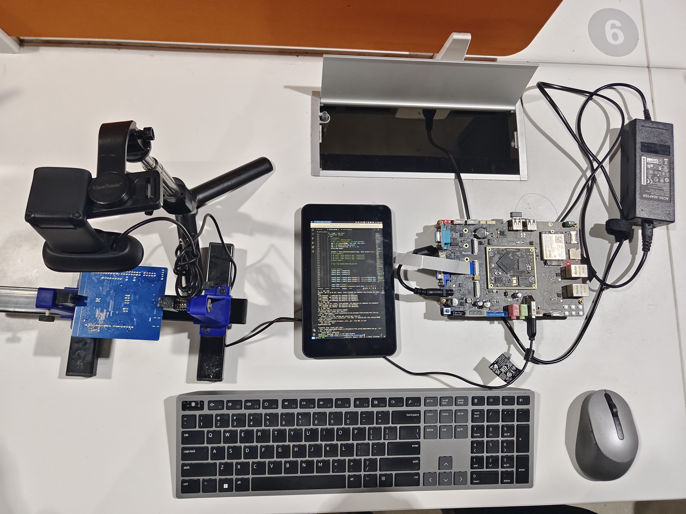

<!-- coding=utf-8
Copyright 2024 Jingze Shi and Bingheng Wu.    All rights reserved.

Licensed under the Apache License, Version 2.0 (the "License");
you may not use this file except in compliance with the License.
You may obtain a copy of the License at

    http://www.apache.org/licenses/LICENSE-2.0

Unless required by applicable law or agreed to in writing, software
distributed under the License is distributed on an "AS IS" BASIS,
WITHOUT WARRANTIES OR CONDITIONS OF ANY KIND, either express or implied.
See the License for the specific language governing permissions and limitations under the License. -->

# Rk3568 开发板实时边缘检测

为了满足实际工业质检的需求，我们将模型部署于开发板Rk3568上，实现基于NPU的实时视频流推理.

- 利用瑞芯微官方提供的`rknn-toolkit-lite2`库将pytorch模型包转化为能够被python调用的`RKNN`模型包,将pytorch模型包在PC端转化为RKNN模型包后RKNN在RK3568开发板上加载使用。
- 针对官方提供的 `C pi` 和 `Python pi`两种解决方案，本团队选取的是 `Python pi`。
- 由于最初训练选区的是模型深度更深，模型精度更精确的yolov8x 系列模型，所以在实际连扳推理时帧率并未达到绝对理想状态，针对实际工业质检生产的需求选取yolov5s系列的小模型会更适应实际需求。 
