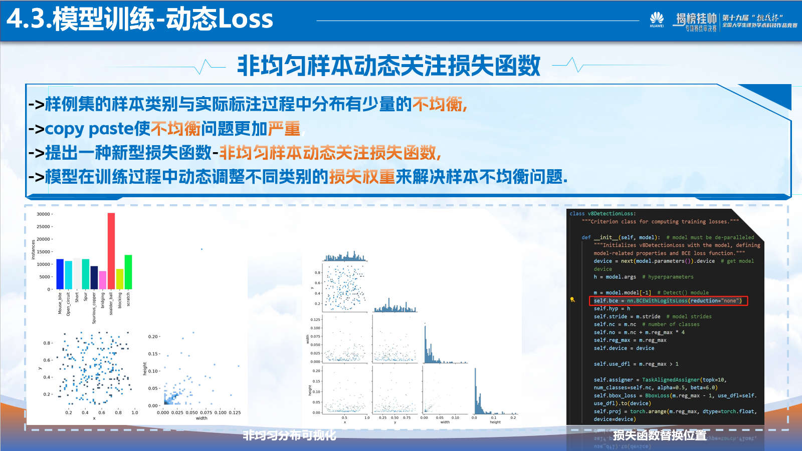
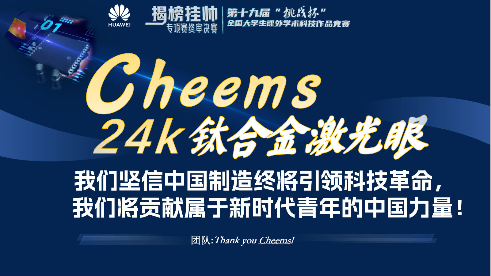

<!-- coding=utf-8
Copyright 2024 Jingze Shi and Bingheng Wu.    All rights reserved.

Licensed under the Apache License, Version 2.0 (the "License");
you may not use this file except in compliance with the License.
You may obtain a copy of the License at

    http://www.apache.org/licenses/LICENSE-2.0

Unless required by applicable law or agreed to in writing, software
distributed under the License is distributed on an "AS IS" BASIS,
WITHOUT WARRANTIES OR CONDITIONS OF ANY KIND, either express or implied.
See the License for the specific language governing permissions and limitations under the License. -->

# PPT
以下是团队参赛PPT 方便快速浏览了解项目核心要点，由于大小限制所以以md图片格式展示，如需完整PPT，请私信(22245657493@qq.com)备注来意。

